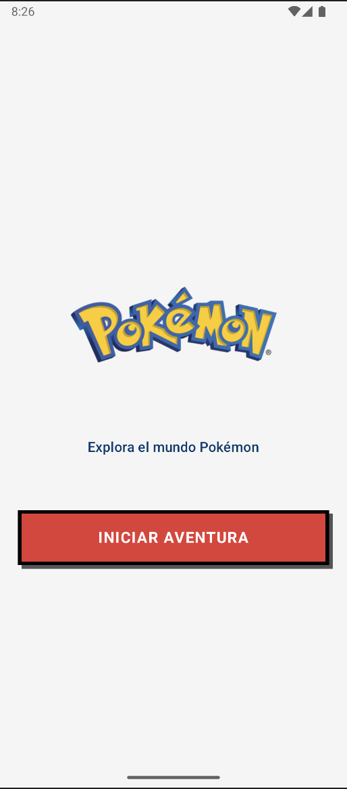
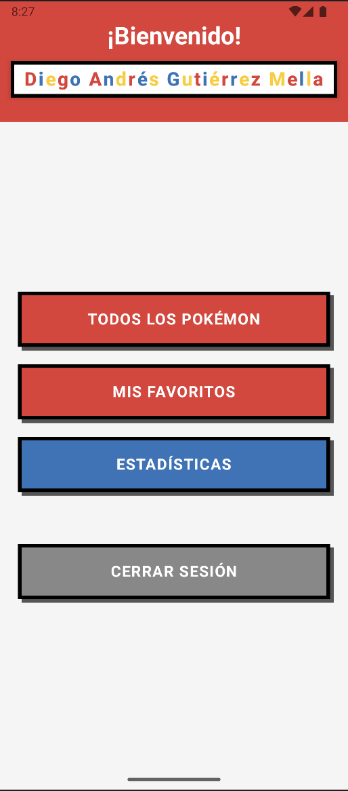
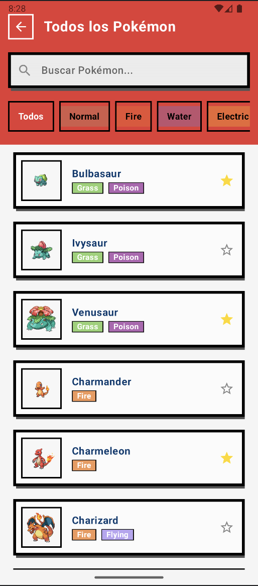
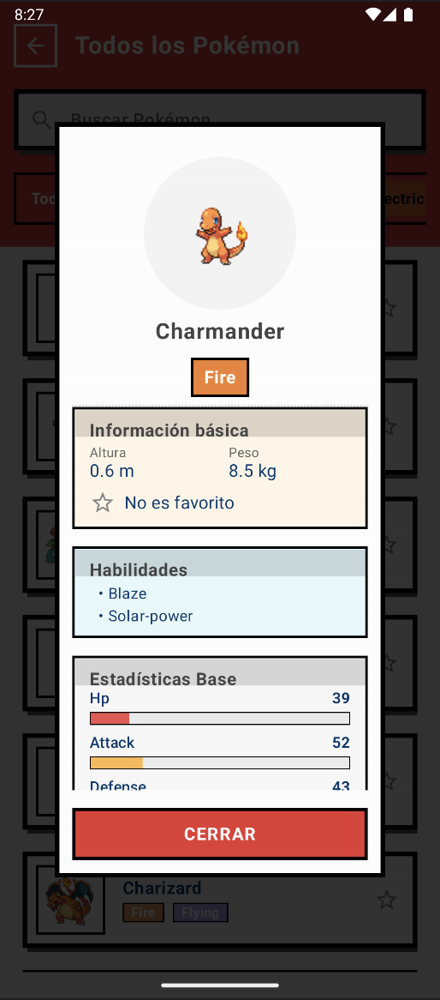
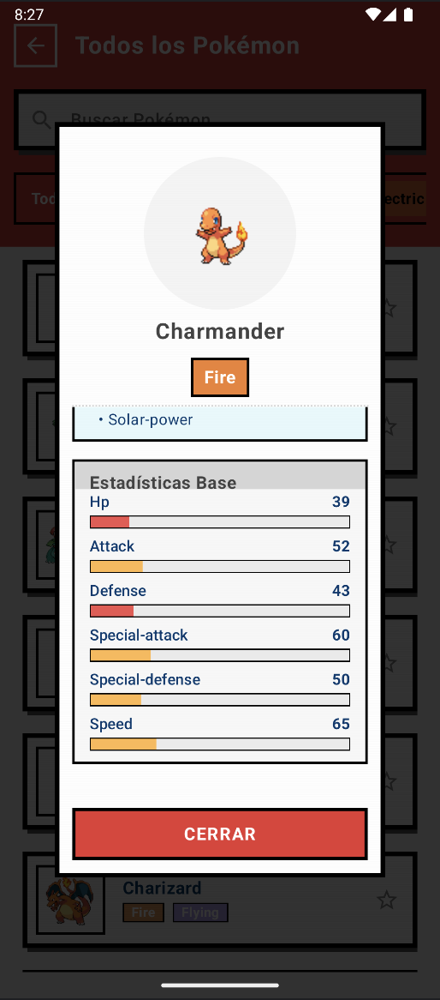
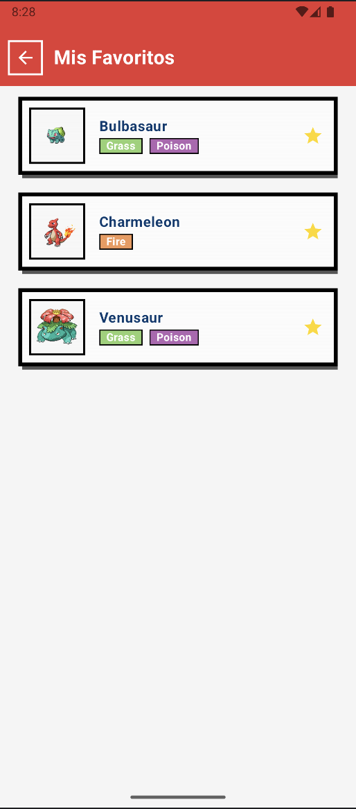
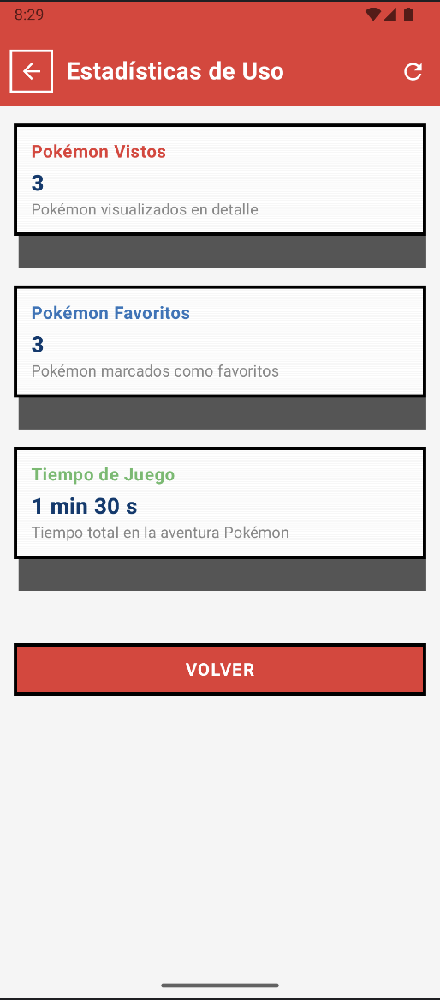

# Talana Poké App

Una aplicación Android para explorar Pokémon, desarrollada con Kotlin y Jetpack Compose. Este proyecto fue creado como parte del proceso de postulación en Talana.

**Autor:** Diego Andrés Gutiérrez Mella

## 📱 Capturas de pantalla

<div align="center">
  
  
  
  
  
  
  
   
</div>

## 📥 Descarga directa

Puedes descargar el APK directamente desde este enlace:
[Descargar APK (Google Drive)](https://drive.google.com/drive/folders/1__IpoStHxiNQ1aw5a1A4zZMq02c3PP9v?usp=sharing)

## 📋 Acerca del desafío

Este proyecto responde al desafío técnico propuesto por Talana, que consiste en desarrollar una aplicación móvil utilizando la PokéAPI con los siguientes requisitos:

- ✅ Autenticación de usuarios mediante OAuth
- ✅ Feed dinámico con información de Pokémon
- ✅ Sistema para agregar Pokémon a favoritos
- ✅ Consulta de detalles adicionales de cada Pokémon
- ✅ Estadísticas de usuario (Pokémon vistos, favoritos, tiempo de uso)

### 🚀 Solución al problema de rendimiento del feed

Uno de los principales desafíos propuestos fue crear un feed dinámico eficiente y suave, incluso en dispositivos antiguos, evitando los problemas de rendimiento causados por el uso de NestedScrollView con múltiples RecyclerViews anidados.

**Solución implementada:**
- Arquitectura optimizada con Jetpack Compose que evita los problemas de RecyclerViews anidados
- Lazy loading para carga progresiva de elementos
- Sistema de caché multinivel (memoria y base de datos) para reducir llamadas a la API
- Procesamiento de imágenes optimizado con Coil
- Uso de coroutines para operaciones asíncronas sin bloquear el hilo principal

### ⭐ Extras implementados

- **Inyección de dependencias:** Implementación con Hilt
- **Autenticación:** Integración con Firebase Authentication y Google Sign-In
- **Características avanzadas:**
  - Buscador de Pokémon con resultados en tiempo real
  - Filtros por tipo de Pokémon con interfaz visual
  - Sistema de estadísticas de usuario
  - Caché con estrategia multinivel y tiempo de expiración

## 🌟 Características

### Funcionalidades principales
- **Catálogo de Pokémon**: Visualiza los primeros 151 Pokémon con detalles
- **Autenticación con Firebase**: Inicio de sesión con Google
- **Favoritos personalizados**: Marca y guarda tus Pokémon favoritos por usuario
- **Estadísticas de uso**: Seguimiento de tu actividad en la app
- **Buscador inteligente**: Encuentra fácilmente cualquier Pokémon por nombre
- **Filtros por tipo**: Filtra Pokémon por cualquiera de los 18 tipos disponibles
- **Navegación fluida**: Experiencia sin interrupciones al navegar entre pantallas

### Detalles de implementación de funcionalidades
- **Catálogo Pokémon**: Implementado con carga eficiente de datos desde PokeAPI
- **Sistema de autenticación**: Flujo de inicio/cierre de sesión con persistencia de estado
- **Gestión de favoritos**: Almacenamiento local de Pokémon favoritos
- **Panel de estadísticas**: Visualización de datos de uso personalizados
- **Motor de búsqueda**: Filtrado en tiempo real con resultados predictivos
- **Sistema de filtros**: Chips interactivos para filtrar por tipo con feedback visual inmediato
- **Caché multinivel**: Estrategia de caché en memoria y persistente para optimizar rendimiento

### Características técnicas
- **UI moderna con Jetpack Compose**: Interfaz fluida y reactiva
- **Arquitectura MVVM**: Código organizado, testeable y mantenible
- **Inyección de dependencias con Hilt**: Componentes desacoplados
- **Estado reactivo con Kotlin Flows**: Actualizaciones en tiempo real de la UI
- **Persistencia con Room**: Caché local y almacenamiento de favoritos
- **Navegación con Navigation Compose**: Transiciones entre pantallas

## 🏗️ Arquitectura

La aplicación sigue la arquitectura MVVM (Model-View-ViewModel) e implementa los principios de Clean Architecture:

```
app/
├── data/                  # Capa de datos
│   ├── local/             # Persistencia local con Room
│   ├── model/             # Modelos de datos
│   ├── network/           # Cliente API con Retrofit
│   └── repository/        # Implementaciones de repositorios
├── di/                    # Módulos de inyección de dependencias con Hilt
├── presentation/          # Capa de presentación
│   ├── auth/              # Autenticación con Firebase
│   ├── mainmenu/          # Pantalla de menú principal
│   ├── navigation/        # Configuración de navegación
│   ├── pokemonlist/       # Listado y detalle de Pokémon
│   └── stats/             # Estadísticas de uso
└── ui/                    # Temas, componentes UI compartidos
```

### Flujo de datos y responsabilidades

#### Capa de Datos
- **Model**: Define entidades y DTOs para mapeo entre API y base de datos
- **Network**: Gestiona comunicación con APIs externas (PokeAPI, Firebase)
- **Local**: Implementa Room para persistencia y cache de datos
- **Repository**: Orquesta fuentes de datos y expone interfaces a la capa de presentación

#### Capa de Presentación
- **ViewModel**: Maneja la lógica de negocio y transforma datos para la UI
- **Screens**: Componentes UI en Compose que observan estados del ViewModel
- **State Holders**: Clases que representan el estado de la UI

## 🔧 Tecnologías utilizadas

### UI y presentación
- **Jetpack Compose**: Framework de UI declarativo
- **Material Design 3**: Componentes modernos y tematización
- **Navigation Compose**: Navegación entre pantallas
- **Coil**: Carga de imágenes

### Datos y lógica
- **Retrofit**: Cliente HTTP para la comunicación con la API
- **Gson**: Serialización/deserialización JSON
- **Room**: Persistencia de datos local
- **Kotlin Coroutines & Flows**: Operaciones asíncronas reactivas
- **Kotlinx Serialization**: Serialización eficiente

### Inyección de dependencias
- **Hilt**: Framework de inyección de dependencias de Android

### Autenticación
- **Firebase Auth**: Autenticación de usuarios
- **Google Sign-In**: Inicio de sesión con Google

## 🚀 Recientes mejoras

### Sistema de caché multinivel
- **Caché en memoria**: Implementación de caché en memoria para navegación instantánea
- **Jerarquía de fuentes de datos**: Consulta priorizada (memoria → base de datos → API)
- **Control de expiración**: Tiempos de expiración diferenciados para cada nivel de caché
- **Recuperación ante fallos**: Uso de caché expirada si falla la red
- **Experiencia de usuario mejorada**: Navegación fluida entre pantallas sin tiempos de carga

### Sistema avanzado de filtros
- **Filtrado por tipo de Pokémon**: Implementado mediante chips interactivos
- **Chips con colores representativos**: Cada tipo de Pokémon tiene su propio color distintivo
- **Combinación de filtros**: Posibilidad de combinar búsqueda por texto y filtro por tipo
- **Experiencia de usuario mejorada**: Selección/deselección intuitiva con feedback visual
- **Diseño pixelado**: Manteniendo la coherencia estética con el resto de la aplicación

### Optimización de rendimiento
- Caché local para reducir llamadas a la API
- Procesamiento de datos con Coroutines
- Carga eficiente de imágenes

### Mejoras en la arquitectura
- Implementación de inyección de dependencias con Hilt
- Datos específicos por usuario
- Optimización del ciclo de vida de los ViewModels

### Estadísticas personalizadas
- Sistema de seguimiento de uso por usuario
- Contador de Pokémon vistos y favoritos
- Seguimiento de tiempo de uso

## 🎨 Diseño

Se proporcionó el siguiente enlace como apoyo de diseño, al cual no se obtuvo acceso:
[Diseño en Figma](https://www.figma.com/design/3uRcJE3a01ZiVcZ0q9FvNj/POGO-%7C-TELOS-Academy-%5BMobile-App-01%5D---Th%E1%BB%8Bnh-%C4%90inh-(Community)?node-id=608-2865&node-type=FRAME&t=ew7LvNKmqPDjR0V3-0)

**Nota:** Aunque se facilitó este enlace, no se otorgó acceso al archivo de Figma durante el desarrollo. Por lo tanto, el diseño de la aplicación se basó en la interpretación de los requisitos y la temática Pokémon, buscando una estética retro y funcional.

## 📝 Notas para desarrolladores

### Requisitos
- Android Studio Flamingo (2022.2.1) o superior
- JDK 17+
- Gradle 8.0+
- Android API 34 (SDK mínimo: 24)

### Instalación
```bash
# Clonar el repositorio
git clone https://github.com/tu-usuario/TalanaPokeApp.git

# Navegar al directorio del proyecto
cd TalanaPokeApp
```

### Configuración
1. Abre el proyecto en Android Studio
2. Sincroniza el proyecto con Gradle (File > Sync Project with Gradle Files)
3. Configura tu proyecto en Firebase para la autenticación:
   - Crea un proyecto en [Firebase Console](https://console.firebase.google.com/)
   - Agrega una aplicación Android con el paquete `com.example.talana_poke_app`
   - Descarga el archivo `google-services.json` y colócalo en el directorio `app/`
4. Ejecuta la aplicación en un emulador o dispositivo físico

### Compilación
Para generar el APK del proyecto:

1. **Desde Android Studio:**
   - Selecciona "Build" en el menú principal
   - Haz clic en "Build Bundle(s) / APK(s)"
   - Selecciona "Build APK(s)"
   - El APK se generará en `app/build/outputs/apk/debug/`
 
### Estructura de paquetes
- **data**: Contiene toda la lógica de acceso a datos
- **di**: Módulos de inyección de dependencias
- **presentation**: Contiene los ViewModels y componentes de UI
- **ui**: Recursos compartidos de UI y temas

El código fuente principal de la aplicación se encuentra bajo el paquete `com.example.talana_poke_app`.

## 🔜 Posibles mejoras futuras
- Implementación de GraphQL para consultas optimizadas a la API
- Soporte para notificaciones push
- Modo sin conexión mejorado
- Tests unitarios y de UI
- Soporte para compartir Pokémon favoritos

## 👨‍💻 Proceso de desarrollo

### Enfoque metodológico
Para abordar este desafío, seguí un proceso iterativo centrado en la funcionalidad principal:

1. **Planificación inicial**: Análisis de requerimientos y diseño de la arquitectura básica
2. **Prototipado rápido**: Implementación de un feed básico con Compose para validar el enfoque
3. **Desarrollo incremental**: Adición progresiva de funcionalidades
4. **Optimización**: Mejora del rendimiento y experiencia de usuario
5. **Pruebas**: Validación manual en dispositivos de diferentes características

### Desafíos técnicos superados
- **Rendimiento del feed**: Resuelto mediante arquitectura optimizada y técnicas de Compose
- **Gestión de estado**: Implementación de flujos de datos unidireccionales con StateFlow
- **Sincronización offline/online**: Sistema de caché con Room
- **Sistema de filtrado**: Implementación de filtros combinados (texto + tipo)
- **Navegación fluida**: Implementación de caché en memoria para evitar recargas innecesarias
